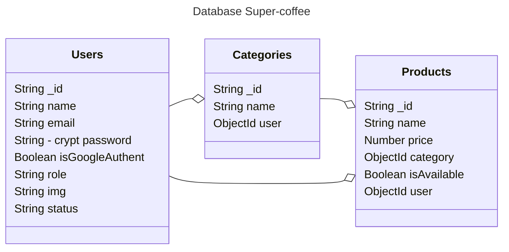

<h1 align="center">
  Course NodeJs
</h1>

<div align="center">

  

</div>

API Rest Server about coffee shop.

## Diagram 


### Install dependencies:

```
yarn install
or
npm install 
```

### Available Scripts

In this project, you can run the following scripts:

| Script        | Description                                         |
| ------------- | --------------------------------------------------- |
| yarn build    | Builds the app for production to the `dist` folder. |
| yarn start    | Runs the app at prod mode.                          |
| yarn dev      | Runs the app in the development mode.               |
| yarn lint:fix  | Format code                                         |

## Base Dependencies

- [cors](https://github.com/expressjs/cors#readme) for providing a Connect/Express middleware.
- [dotenv](https://github.com/motdotla/dotenv#readme) loads environment variables from a .env file into process.env.
- [express](https://expressjs.com/) framework for Node.js.

